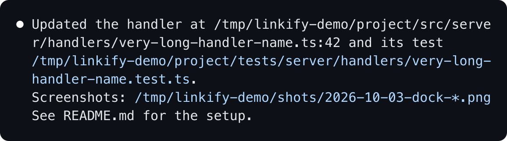
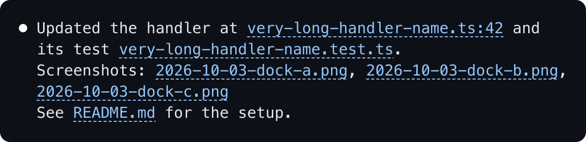

# Cyberine Linkify


A Claude Code plugin that turns file paths in Claude's replies into short clickable links. Claude Code hard-wraps long lines, so a long path printed as text or inline code splits across two terminal rows and cmd+click opens nothing; a glob such as `shots/*.png` is never clickable at all. Linkify rewrites what the transcript draws: each path that exists on your machine becomes a link whose label is just the file name, which fits in a narrow pane, and whose target is the full `file://` URL.

It changes the drawing only. The stored conversation, what Claude reads back, and `ctrl+o` stay exactly as Claude wrote them.

Requires Claude Code 2.1.287 or newer. The plugin is a mod (function hooks), which loads in the terminal and in the Desktop app's Code tab. Links are clickable where the terminal supports OSC 8 hyperlinks (Ghostty, iTerm2, WezTerm, kitty, VS Code's terminal and others); inside tmux, add `set -as terminal-features ",*:hyperlinks"` to your tmux config.

Before, in a 60-column pane:



After:



## Install

```
/plugin marketplace add cyberinecore/cc-linkify
/plugin install cyberine-linkify@cyberine-linkify
```

Or from a shell, outside a session:

```
claude plugin marketplace add cyberinecore/cc-linkify
claude plugin install cyberine-linkify@cyberine-linkify
```

To try a local checkout for one session instead:

```
claude --plugin-dir /path/to/cc-linkify
```

## What becomes a link

| Written in the reply | Drawn as |
|---|---|
| `/Users/me/work/app/src/server/handlers/session-handler.ts` | `session-handler.ts` |
| `~/work/app/README.md` | `README.md` |
| `src/server/app.ts`, `./src/app.ts`, `../shared/types.ts` (against the session's working directory) | `app.ts`, `types.ts` |
| `package.json` (a bare name, only when it sits directly in the working directory) | `package.json` |
| `src/app.ts:42`, `src/app.ts:42:7`, `src/app.ts#L10-L20`, `src/app.ts(10,5)` | `app.ts:42`, `app.ts:42:7`, `app.ts:10-20`, `app.ts:10:5` |
| `src/app.ts:12:const x = 1` (grep output) | `app.ts:12` followed by `:const x = 1` |
| `shots/*.png`, `src/{a,b}.ts`, `src/[ab].ts`, `src/**/*.test.ts` | one link per matching file, at most 10, then `(+N more)` |
| `file:///Users/me/My%20Notes/todo.md`, `<file:///...>` | `todo.md` |

Paths inside inline code are linked when the code span holds nothing but the path; the backticks go, the link stays. A path in quotes, in `**bold**`, or with an escaped space (`my\ file.md`) is linked whole. When two links in one reply would share a label, each label grows by parent folders until they differ (`api/src/index.ts`, `web/src/index.ts`). A folder's label ends in `/`. The line number goes in the label only, never in the URL, because `file://` carries no line and some terminals refuse a URL with `:42` on the end.

Left exactly as written:

- Anything that does not exist on disk, so prose such as `and/or`, `1/2` or `/clear` is never touched.
- Fenced code blocks (also inside lists and blockquotes), indented code blocks, and inline code that holds more than a path, such as `cat /etc/hosts`.
- Existing Markdown links and images, reference links and their definitions, autolinks, HTML tags and comments, and `http(s)://` URLs.
- A path glued to a word, such as `user@host:/srv/app` or `pre-/tmp/x`.

## What it reads, writes, runs and sends

- Files it reads: none. It never opens a file's contents.
- File metadata (`fs.stat`, `fs.exists`, `fs.list`): for each path-shaped word in a reply, whether that path exists and whether it is a file or a folder; for a glob, the names in the folders the glob walks (at most 64 folders, 4 levels below a `**`). Results are kept in memory for 30 seconds and dropped when the session ends.
- Environment and session (`env.get`, `session.cwd`): `HOME`, only when a reply holds a `~/` path, to expand it; the session's working directory, only when a reply holds a relative path or a bare file name.
- Hooks it registers: `ui.render` for `AssistantMessage`, which rewrites the text of one reply block for drawing. Nothing else.
- Files it writes, programs it runs, what it stores: none, none, nothing. It has no store and no `$.state`.
- What it sends off the machine: nothing. It has no network code. See `PRIVACY.md`.

## Troubleshooting

- Nothing is linked: run `/plugin` and check that the plugin's mod is active. The debug log line "hooks modules are turned off for installed plugins in this process: the rollout switch served off" means Anthropic has turned installed mods off remotely for that launch; restart Claude Code later.
- Labels show but cmd+click does nothing inside tmux: tmux drops hyperlinks unless `terminal-features` includes `hyperlinks`; add the line above and reattach.
- A path is not linked: it must exist on this machine when the reply is drawn. A missing path is remembered for 30 seconds, so a file created after the reply is linked on the next redraw after that (resize the window, or scroll the reply out and back).

## Develop

```
npm test                                   # packaging rules
claude plugin validate . --strict
claude plugin validate .claude-plugin/plugin.json --strict
claude plugin test .                       # transform and hook tests
```

`hooks/register.ts` holds the hook and every function that touches the engine, because the engine follows `$` only within one file. The transform itself is pure and synchronous, in `src/linkify.ts`: it splits the reply into code and prose blocks, scans prose for protected Markdown, resolves path candidates against a lookup, and reports what it still needs to know; the hook answers those lookups with `$.fs` and runs it again.

## License

MIT, see `LICENSE`.
